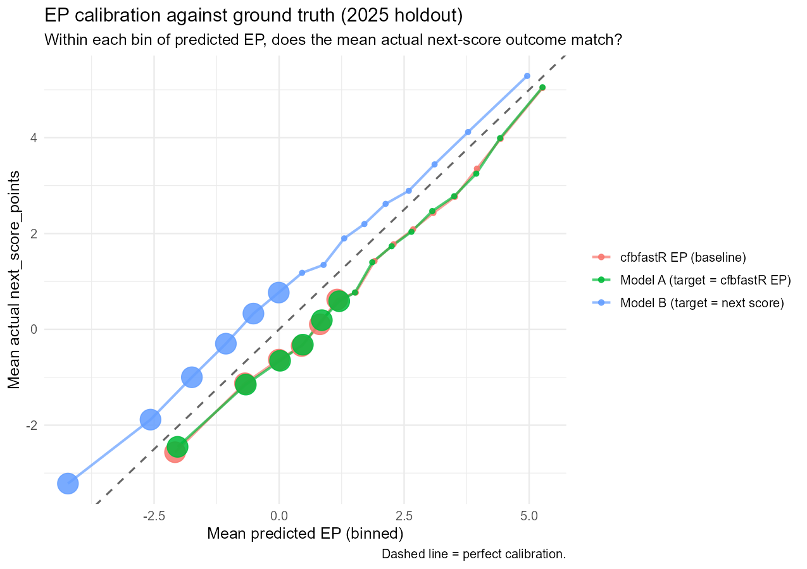
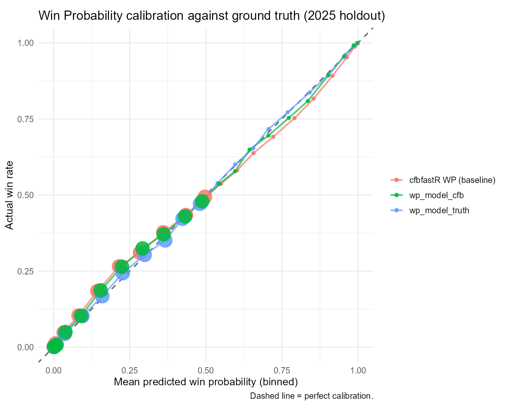

# Dowling Catholic Football Analytics

A game-day and scouting analytics platform for Dowling Catholic High School football (Des Moines, IA). It combines custom **Expected Points (EP)** and **Win Probability (WP)** models trained on 12 seasons of college football play-by-play data, real-time **4th Down** and **Go for 2** decision tools, and a multipage **Streamlit** scouting app used by the coaching staff for weekly game prep, game review, and self-scouting.

> **Note:** The deployed app is access-restricted because it contains team scouting data. A public demo version is in progress.

<!-- TODO: add 2-3 screenshots here (Home page, a self-scout tendency tree, the 4th Down Bot) -->

---

## What's inside

### 1. Scouting & game review app (`app.py`)
A multipage Streamlit app built on Dowling's tagged play-by-play data.

| Area | What it does |
|---|---|
| **Dowling Offense / Defense** | Run game, pass game, red zone, and weekly trend breakdowns with success rate, EPA, and explosive-play rate |
| **Self-Scout** | Tendency trees, field-position and formation-strength splits, and play-sequencing analysis that uses two-proportion z-tests to flag predictable call patterns |
| **Opponent Scouting** | The same tendency, sequencing, field-position, and red-zone views applied to upcoming opponents |
| **Team Profiles** | Radar charts that benchmark Dowling and opponents against FBS teams (built from cfbfastR data via `build_cfb_benchmarks.py`) |
| **Special Teams** | Unit summary cards, special teams EPA, field-position battle by game, field goal range, and punt maps |
| **Game Recap & Season Drives** | Postgame summaries and drive-level results across the season |
| **Win Probability & 4th-Down Review** | WP charts by game and a postgame review of every 4th-down decision against the bot's recommendation |
| **Scouting Report & Matchup** | Printable opponent report and side-by-side matchup view |
| **Play Finder & Sideline Mode** | Fast filtering for specific situations and a phone-friendly view for game day |
| **Add a Game** | Upload a new film-tagging export; `curate_pbp.py` standardizes it and appends it to the dataset |

Coach notes can optionally be saved to a Google Sheet, and the app can be password-protected (see [Configuration](#configuration)).

### 2. Expected Points & Win Probability models
XGBoost models trained in R on [cfbfastR](https://cfbfastr.sportsdataverse.org/) play-by-play data.

- **Data split:** fit on 2014–2023, early stopping on 2024, final metrics reported only on a 2025 holdout.
- **EP (`cfb_ep_model.R`):** two regression models: one trained on cfbfastR's built-in `ep_before`, one trained directly on the next score in the half (the ground-truth target). Both are evaluated against cfbfastR and against actual outcomes.
- **WP (`cfb_wp_model.R`, `model_training/`):** compares a model trained on actual game outcomes with one trained to replicate cfbfastR's `wp_before`. The shipped model uses **monotone constraints** on the field-position features (EP, yards to goal, distance) so win probability can't rise as the offense moves away from the goal line. Score and clock are left unconstrained, because constraining them hurt accuracy in late one-score games, where 4th-down calls matter most.

| EP calibration | WP calibration |
|---|---|
|  |  |

Trained models are exported to JSON (`cfb_ep_model.json`, `cfb_wp_model_*.json`) and loaded in Python by `model_utils.py`.

### 3. Game-day decision tools
- **4th Down Bot (`Fourth_Downs.py`, `fourth_down_core.py`):** compares the win probability of going for it, kicking a field goal, and punting, using the EP/WP models together with conversion-probability, field-goal (including wind adjustments), and punt-distance curves. The decision logic is kept separate from the Streamlit code so the postgame 4th-down review reuses the exact same math.
- **Go for 2 Bot (`Go_for_2.py`):** recommends going for 2, kicking the PAT, or coach's choice based on score and time remaining, following ESPN's game-management cheat sheet. It also shows Dowling's own PAT record.

---

## Project structure

```
app.py                  Streamlit entrypoint: navigation, filters, page layouts
visuals.py              Scouting data prep, tables, and charts
breakdowns.py           Tendency trees, field/strength splits, sequencing, drives, red zone
insights.py             Game recap, self-scout, matchup, scouting report, WP / 4th-down review
profiles.py             FBS-benchmarked team profile radar charts
special_teams.py        Special teams page
curate_pbp.py           Play-by-play curation pipeline (used by "Add a game")
fourth_down_core.py     4th Down Bot decision math (no Streamlit code)
Fourth_Downs.py         4th Down Bot page
Go_for_2.py             Go for 2 Bot page
model_utils.py          Loads the EP/WP models
qol.py                  Password gate, coach notes, quality-of-life helpers
build_cfb_benchmarks.py Builds cfb_benchmarks.csv from cfbfastR play-by-play
cfb_ep_model.R          EP model training (R)
cfb_wp_model.R          WP model training (R)
model_training/         Python WP training pipeline: download, prep, train, evaluate
tests/                  Unit tests for breakdowns and 4th-down logic
```

---

## Running locally

```bash
git clone https://github.com/zcalvert29/Dowling-Football.git
cd Dowling-Football
pip install -r requirements.txt
streamlit run app.py
```

Run the tests with:

```bash
pytest tests/
```

To retrain the models, run `cfb_ep_model.R` and `cfb_wp_model.R` in R (requires a free [CFBD API key](https://collegefootballdata.com)), or use the Python pipeline in `model_training/` (`download.py` → `prep.py` → `train.py` → `evaluate.py`).

## Configuration

Copy `secrets.toml.example` to `.streamlit/secrets.toml` (or paste it into Streamlit Cloud → Settings → Secrets). Every entry is optional:

- `app_password`: require a password to open the app
- `next_opponent`: default opponent on the Home and Scouting pages
- `notes_sheet_url` and `[gcp_service_account]`: save coach notes to a Google Sheet

---

## Tech stack
**Python** (Streamlit, pandas, NumPy, XGBoost, Altair, Matplotlib, gspread) · **R** (cfbfastR, dplyr, xgboost) · pytest

## Author
**Zack Calvert**: Data Analyst / Statistician, Dowling Catholic Football · [LinkedIn](https://linkedin.com/in/zack-calvert) · [Substack](https://zcalvert.substack.com)
